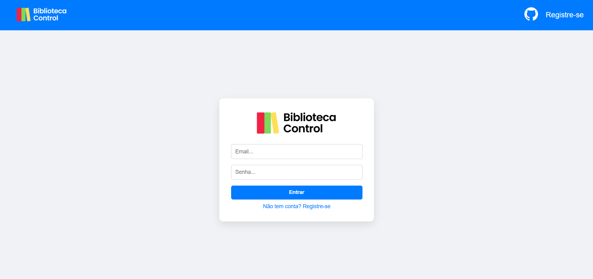
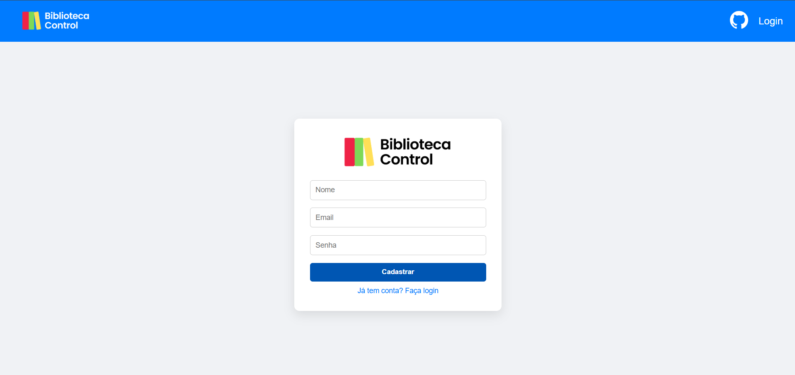
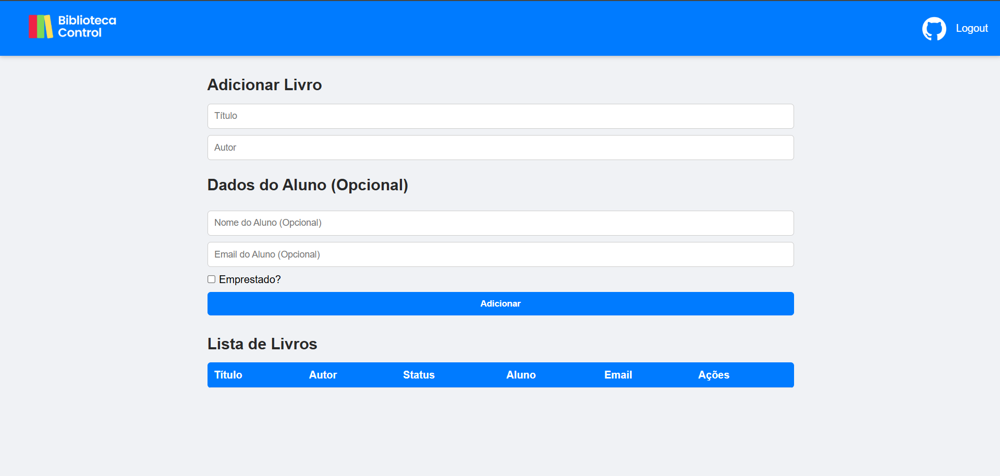

<p align="center">
  
</p>

# 📚 Biblioteca Control - Sistema de Gestão de Biblioteca


---

## 📌 Descrição

**Biblioteca Control** é um sistema para gestão digital de bibliotecas escolares, que permite cadastrar livros e usuários, controlar empréstimos e devoluções, e gerar relatórios detalhados sobre o acervo.
O sistema substitui o controle manual feito em papel, oferecendo mais eficiência, organização e segurança na gestão do patrimônio da escola.

---

## ⚙️ Funcionalidades

* Cadastro e gerenciamento de **livros** (título, autor e status).
* Controle de **empréstimos e devoluções**
* Consulta rápida ao acervo por **título e autor**.
* Visualização do **status dos livros** (disponível ou emprestado).

---

## 💻 Tecnologias utilizadas

* **Java 24**
* **Spring Boot 3.5.6**
* **Spring Data JPA**
* **Thymeleaf**
* **MySQL**
* **HTML/CSS**
* **Lombok**

---

## ▶️ Como executar

1. Clone o repositório:

   ```bash
   git clone https://github.com/seu-usuario/biblioteca-control.git
   ```

2. Configure o banco MySQL (`biblioteca`) e atualize `application.properties` com usuário e senha.

3. Compile e execute a aplicação Spring Boot via IDE ou Maven:

   ```bash
   mvn clean install
   mvn spring-boot:run
   ```

4. Acesse o sistema pelo navegador:

   ```
   http://localhost:8080/index.html
   ```

5. Use o front-end para **cadastro de livros e usuários**, realizar **empréstimos e devoluções**, e consultar o acervo.

---

## 🎯 Objetivo do Projeto

O projeto visa modernizar a gestão da biblioteca escolar, reduzindo perdas de livros, otimizando o controle de empréstimos e devoluções, e permitindo a geração de relatórios detalhados sobre o acervo.

**Metas principais:**

* Controlar empréstimos e devoluções automaticamente.
* Reduzir perdas e otimizar o gerenciamento de recursos da escola.

---

## ⚖️ Partes Interessadas

* **Gestores da biblioteca** – responsáveis pelo controle do acervo e empréstimos.
* **Alunos** – podem consultar e emprestar livros.
* **Professores** – terão acesso ao acervo para planejamento de aulas e projetos.
* **Direção da escola** – garante melhor aproveitamento do patrimônio.

---

## 🚦 Premissas e Restrições

* Sistema **local**, sem necessidade de hospedagem online.
* **Feito em 20 dias** como projeto solo.
* Banco de dados **MySQL** local.
* Backend em **Java Spring Boot** e frontend em **Thymeleaf**.
* Não inclui versão mobile nem acesso remoto via internet.

---

## 📸 Screenshots

**Tela de login:**


**Tela de registro de livros e alunos:**


**Tela principal (home) com lista de livros:**


---

